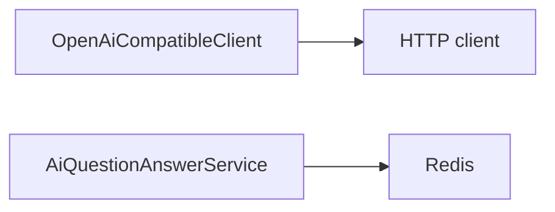

<!-- auto-generated: architecture:start -->
# Architecture

<!-- generated-from: sha256:5b57ff9c7b1f2038d65744e95a058c42dddf4a6026b85c00d751ffb452cc23f6 -->
<!-- generated-by: improve-java-readability -->

## External dependency flow

The conservative evidence index establishes these external boundaries:

## External systems

| System | Used by | Evidence |
| --- | --- | --- |
<!-- evidence-claim: {"kind":"node","id":"external:HTTP client"} -->
| `HTTP client` | `OpenAiCompatibleClient` | [campus-forum-backend/src/main/java/com/campus/ai/client/OpenAiCompatibleClient.java:336](../campus-forum-backend/src/main/java/com/campus/ai/client/OpenAiCompatibleClient.java#L336) |
<!-- evidence-claim: {"kind":"node","id":"external:Redis"} -->
| `Redis` | `AiQuestionAnswerService`, `AuthService`, `AuthServiceTest`, `OtpBruteForceTest`, `SchoolEmailTest`, `TokenVersionRevokeTest`, `OtpStore`, `RefreshTokenStore`, `RefreshTokenStoreTest`, `RateLimitInterceptor`, `RateLimitInterceptorTest`, `SecurityTest`, `RedisUtil` | [campus-forum-backend/src/main/java/com/campus/ai/service/AiQuestionAnswerService.java:44](../campus-forum-backend/src/main/java/com/campus/ai/service/AiQuestionAnswerService.java#L44) |
<!-- auto-generated: architecture:end -->
